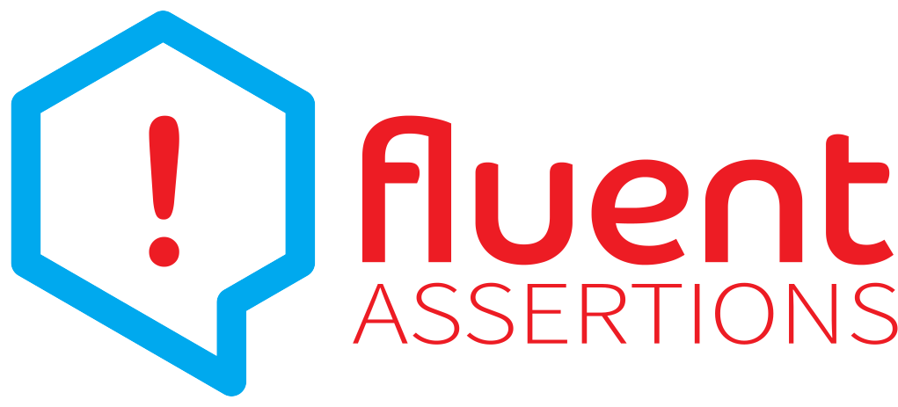

# Extension methods to fluently assert the outcome of .NET tests

A very extensive set of extension methods that allow you to more naturally specify the expected outcome of a TDD or BDD-style unit tests. Targets .NET Framework 4.7, as well as .NET 6, .NET Standard 2.0 and 2.1.

See https://www.fluentassertions.com for [background information](https://fluentassertions.com/about/), [usage documentation](https://fluentassertions.com/introduction), an [extensibility guide](https://fluentassertions.com/extensibility/), support information and more [tips & tricks](https://fluentassertions.com/tips/).

# Who created this?
Originally authored by Dennis Doomen with Jonas Nyrup as the productive side-kick. Notable contributions were provided by Artur Krajewski, Lukas Grützmacher and David Omid.

# How do I build this?
Install Visual Studio 2022 17.0+ or JetBrains Rider 2021.3 as well as the Build Tools 2022 (including the Universal Windows Platform build tools). You will also need to have .NET Framework 4.7 SDK and .NET 7.0 SDK installed. Check [global.json](global.json) for the current minimum required version.

# What are these Approval.Tests?
This is a special set of tests that use the [Verify](https://github.com/VerifyTests/Verify) project to verify whether you've introduced any breaking changes in the public API of the library.

If you've verified the changes and decided they are valid, you can accept them  using `AcceptApiChanges.ps1` or `AcceptApiChanges.sh`. Alternatively, you can use the [Verify Support](https://plugins.jetbrains.com/plugin/17240-verify-support) plug-in to compare the changes and accept them right from inside Rider. See also the [Contribution Guidelines](CONTRIBUTING.md).

# Powered By
&nbsp;
&nbsp;

With support from the following public [sponsors](https://github.com/sponsors/fluentassertions)

