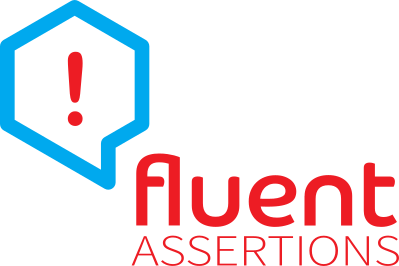

***"With Fluent Assertions, the assertions look beautiful, natural and most importantly, extremely readable"*** -[_Girish_](https://twitter.com/girishracharya)

* See [fluentassertions.com](http://fluentassertions.com/) for more information about this project.
* Check out the [documentation](http://fluentassertions.com/documentation.html) for the details of the API.
* The build status is 
* Join the chat at the [official Slack channel](https://fluentassertionsslack.herokuapp.com/)

