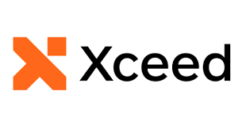

<h1 align="center">
  <br>
<a href="https://www.fluentassertions.com"></a>

Extension methods to fluently assert the outcome of .NET tests
  <br>
</h1>

<div align="center">

[](https://github.com/fluentassertions/fluentassertions/actions?query=branch%3Adevelop)
[](https://coveralls.io/github/fluentassertions/fluentassertions?branch=main)
[](https://github.com/fluentassertions/fluentassertions/actions/workflows/code_quality.yml)
[](https://github.com/FluentAssertions/FluentAssertions/releases/latest)
[](https://www.nuget.org/packages/FluentAssertions)
[](https://libraries.io/nuget/FluentAssertions)

[](https://github.com/fluentassertions/fluentassertions/graphs/contributors)
[](https://github.com/fluentassertions/fluentassertions)
[](https://github.com/fluentassertions/fluentassertions/graphs/commit-activity)
[](https://github.com/fluentassertions/fluentassertions/issues)


<a href="#about">About</a> •
<a href="#download">Download</a> •
<a href="#how-do-i-use-it">How To Use</a> •
<a href="#building">Building</a> •
<a href="#contributing">Contributing</a> •
<a href="#versioning">Versioning</a> •

</div>

# About

Fluent Assertions offers a comprehensive suite of extension methods that enable developers to naturally express the expected outcomes of TDD (Test-Driven Development) or BDD (Behavior-Driven Development) unit tests. By providing a more readable and intuitive approach to writing assertions, it streamlines the testing process and improves code clarity. It supports a wide range of .NET platforms, including .NET Framework 4.7, .NET Core 2.1, 3.0, and 6, as well as .NET Standard 2.0 and 2.1, ensuring compatibility across various modern development environments.

# Xceed Partnership
Originally authored by Dennis Doomen with Jonas Nyrup as the productive side-kick. Xceed is now an official Partner to Fluent Assertions! [Learn what this partnership means for our users](https://xceed.com/fluent-assertions-faq/). After extensive discussions with the Fluent Assertions team, we are thrilled about the future of the product and look forward to its continued growth and development.

# Download

This library is available as a NuGet package on https://nuget.org. To install it, use the following command-line:

`dotnet add package FluentAssertions`

# How do I use it

Fluent Assertions contains a tremendous amount of assertion methods that will make your unit tests easier to read and give you as much information possible upon failure. Consider this example.

```csharp
IEnumerable<int> numbers = new[] { 1, 2, 3 };

numbers.Should().OnlyContain(n => n > 0);
numbers.Should().HaveCount(4, "because we thought we put four items in the collection");
```

This should give you the following failure:

```text
Expected numbers to contain 4 item(s) because we thought we put four items in the collection, but found 3.
```

Visit https://www.fluentassertions.com for [background information](https://fluentassertions.com/about/), [usage documentation](https://fluentassertions.com/introduction), an [extensibility guide](https://fluentassertions.com/extensibility/), support information and more [tips & tricks](https://fluentassertions.com/tips/).

# Building
Install Visual Studio 2022 17.14+ or JetBrains Rider 2024.3 as well as the Build Tools 2022 (including the Universal Windows Platform build tools). You will also need to have .NET Framework 4.7 SDK and .NET 9.0 SDK installed. Check the [global.json](global.json) for the current minimum required version.

You can also build, run the unit tests and package the code using the following command-line:

`build.ps1`

Or, if you have, the [Nuke tool installed](https://nuke.build/docs/getting-started/installation/):

`nuke`

Also try using `--help` to see all the available options or `--plan` to see what the scripts does.

## What are these Approval.Tests?
This is a special set of tests that use the [Verify](https://github.com/VerifyTests/Verify) project to verify whether you've introduced any breaking changes in the public API of the library.

If you've verified the changes and decided they are valid, you can accept them  using `AcceptApiChanges.ps1` or `AcceptApiChanges.sh`. Alternatively, you can use the [Verify Support](https://plugins.jetbrains.com/plugin/17240-verify-support) plug-in to compare the changes and accept them right from inside Rider. See also the [Contribution Guidelines](CONTRIBUTING.md).

# Contributing
Your contributions are always welcome! Please have a look at the [contribution guidelines](CONTRIBUTING.md) first.

# Versioning
This library uses [Semantic Versioning](https://semver.org/) to give meaning to the version numbers. For the versions available, see the [tags](/releases) on this repository.

## Credits
This library wouldn't have been possible without the following tools, packages and companies:

* [Nuke](https://nuke.build/) - Smart automation for DevOps teams and CI/CD pipelines by [Matthias Koch](https://github.com/matkoch)
* [xUnit](https://xunit.net/) - Community-focused unit testing tool for .NET by [Brad Wilson](https://github.com/bradwilson)
* [Coverlet](https://github.com/coverlet-coverage/coverlet) - Cross platform code coverage for .NET by [Toni Solarin-Sodara](https://github.com/tonerdo)
* [GitVersion](https://gitversion.net/) - From git log to SemVer in no time
* [ReportGenerator](https://reportgenerator.io/) - Converts coverage reports by [Daniel Palme](https://github.com/danielpalme)
* [StyleCopyAnalyzer](https://github.com/DotNetAnalyzers/StyleCopAnalyzers) - StyleCop rules for .NET
* [Roslynator](https://github.com/dotnet/roslynator) - A set of code analysis tools for C# by [Josef Pihrt](https://github.com/josefpihrt)
* [CSharpCodingGuidelines](https://github.com/bkoelman/CSharpGuidelinesAnalyzer) - Roslyn analyzers by [Bart Koelman](https://github.com/bkoelman) to go with the [C# Coding Guidelines](https://csharpcodingguidelines.com/)
* [Meziantou](https://github.com/meziantou/Meziantou.Framework) - Another set of awesome Roslyn analyzers by [Gérald Barré](https://github.com/meziantou)
* [Verify](https://github.com/VerifyTests/Verify) - Snapshot testing by [Simon Cropp](https://github.com/SimonCropp)

# Powered By
<a href="https://www.xceed.com"></a>

## License
Versions 8 and beyond are free for open-source projects and non-commercial use, but commercial use requires [a paid license](https://xceed.com/products/unit-testing/fluent-assertions/). 
Check out the [license page](LICENSE) for more information. 

Version 7 will remain fully open-source indefinitely and receive bugfixes and other important corrections.
