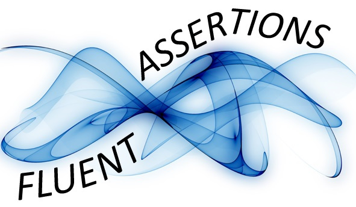

## What is Fluent Assertions?

Fluent Assertions is a set of .NET extension methods that allow you to more naturally specify the expected outcome of a TDD or BDD-style test.

## Why?

Nothing is more annoying than a unit test that fails without clearly explaining why. More than often, you need to set a breakpoint and start up the debugger to be able to figure out what went wrong. Jeremy D. Miller once gave the advice to "keep out of the debugger hell" and I can only agree with that.

For instance, only test a single condition per test case. If you don't, and the first condition fails, the test engine will not even try to test the other conditions. But if any of the others fail, you'll be on your own to figure out which one. I often run into this problem when developers try to combine multiple related tests that test a member using different parameters into one test case. If you really need to do that, consider using a parameterized test that is being called by several clearly named test cases.

That’s why we designed Fluent Assertions to help you in this area. Not only by using clearly named assertion methods, but also by making sure the failure message provides as much information as possible. Consider this example:

```c#
"1234567890".Should().Be("0987654321");
```

This will be reported as:

> Expected string to be
"0987654321", but
"1234567890" differs near "123" (index 0).

The fact that both strings are displayed on a separate line is not a coincidence and happens if any of them is longer than 8 characters. However, if that's not enough, all assertion methods take an optional explanation (the because) that supports formatting placeholders similar to String.Format which you can use to enrich the failure message. For instance, the assertion

```c#
new[] { 1, 2, 3 }.Should().Contain(item => item > 3, "at least {0} item should be larger than 3", 1);
```

will fail with:

> Collection {1, 2, 3} should have an item matching (item > 3) because at least 1 item should be larger than 3.

## Supported Frameworks and Libraries

It supports the following .NET versions.

*   .NET 4.0, 4.5 and 4.6
    * [FluentAssertions 2.2](https://www.nuget.org/packages/FluentAssertions/2.2.0) supports .NET 3.5
*   CoreClr, .NET Native and Universal Windows Platform
*   Windows Store Apps for Windows 8.1
*   Silverlight 5
*   Windows Phone 8.1
*   Windows Phone Silverlight 8.0 and 8.1
*   Portable Class Libraries

It supports the following unit test frameworks:

*   MSTest (Visual Studio 2010, 2012 Update 2, 2013 and 2015)
*   MSTest2 (Visual Studio 2017)
*   [NUnit](http://www.nunit.org/)
*   [XUnit](http://xunit.codeplex.com/)
*   [XUnit2](https://github.com/xunit/xunit/releases)
*   [MBUnit](http://code.google.com/p/mb-unit/)
*   [Gallio](http://code.google.com/p/mb-unit/)
*   [NSpec](http://nspec.org/)
*   [MSpec](https://github.com/machine/machine.specifications)

## Community Extensions

There are a number of community maintained extension projects. The ones we are aware of a listed below. To add yours please fork the [repository](https://github.com/dennisdoomen/fluentassertions/tree/gh-pages) and send a pull request.

*   [FluentAssertions.Ioc.Ninject](https://github.com/kevinkuszyk/FluentAssertions.Ioc.Ninject) for testing Ninject bindings.
*   [FluentAssertions.Mvc](https://github.com/CaseyBurns/FluentAssertions.MVC) for testing MVC applications.
*   [Xamarin](https://github.com/onovotny/fluentassertions) version for Mono support.
*   [FluentAssertions.Autofac](https://github.com/awesome-inc/FluentAssertions.Autofac) for testing Autofac configurations.

## Special thanks

This project would not have been possible without the support of [JetBrains](http://www.jetbrains.com/). We thank them generously for providing us with the [ReSharper](http://www.jetbrains.com/resharper/) licenses necessary to make us productive developers.  


